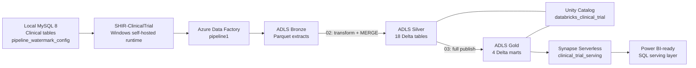

# Architecture

## Purpose

The platform converts operational clinical-trial data into governed analytical datasets. It separates ingestion, conformance, business modeling, and serving so each layer has a clear responsibility.

## End-to-end architecture



## Layer responsibilities

### MySQL source

MySQL holds the operational clinical-trial model and `pipeline_watermark_config`. The metadata table supplies, per enabled table:

- source table name;
- primary-key column;
- load type;
- watermark column;
- last committed watermark.

This allows one ADF pipeline to process multiple tables without one pipeline per table.

### Self-hosted Integration Runtime

`SHIR-ClinicalTrial` bridges Azure Data Factory to MySQL on `localhost`. It is an implemented connectivity component and was used during ingestion.

It is also an operational dependency. A scheduled extraction requires:

- the Windows host to be powered on;
- network access to Azure;
- the SHIR Windows service/node to be healthy;
- local MySQL to be running and listening.

Closing the SHIR desktop UI is not equivalent to stopping the runtime service. Operations should check the Windows service and ADF node heartbeat.

### Azure Data Factory

ADF `pipeline1` performs control-plane ingestion:

```text
LKP_GetTableList
    |
    v
FE_LoopTables
    |
    +--> CP_MySQLToADLS
    |
    +--> LKP_GetNewWatermark
    |
    +--> LKP_UpdateWatermark
```

The lookup reads enabled rows from `pipeline_watermark_config`. The `ForEach` passes each table's metadata to dynamic extraction logic. Incremental tables use their watermark bounds; full-load/configuration tables can use full extraction according to metadata.

The post-copy activities obtain the new watermark and update source metadata through the configured watermark procedure/logic.


### Bronze

Bronze is the source-aligned landing layer:

- Parquet format;
- one folder per source table;
- only new/changed rows selected for incrementally configured tables;
- full extracts permitted for tables configured as full load.

Bronze preserves source shape for downstream transformation. It is not directly merged into Silver without transformation.

### Silver

Silver is the conformed, reusable Delta layer.

Notebook `02_incremental_bronze_to_silver_merge`:

1. reads each Bronze batch;
2. skips an empty batch;
3. calls `transform_silver()`;
4. aligns data types and adds audit fields;
5. matches on the configured primary key;
6. updates matched rows and inserts unmatched rows.

The important design rule is:

```text
Bronze batch
    |
    v
transform_silver()
    |
    v
Silver-shaped DataFrame
    |
    v
Delta MERGE
```

Raw Bronze is never merged directly. Silver is the correct layer for validating source attributes such as `weight_kg` and `bmi`.

### Unity Catalog

Catalog `databricks_clinical_trial` governs external Delta tables in:

- schema `silver`;
- schema `gold`.

Unity Catalog provides a stable three-part namespace, discoverability, table metadata, and an access-control boundary. Data remains in project ADLS locations while tables are registered in the catalog.

### Gold

Notebook `03_silver_to_gold_publish` rebuilds:

- `gold.patient_study_summary`
- `gold.lab_summary`
- `gold.safety_adverse_events`
- `gold.visit_summary`

Gold uses `CREATE OR REPLACE TABLE` from the latest trusted Silver state.

This is intentional:

- the marts contain joins and derived metrics;
- their current volumes are small;
- a full rebuild avoids complicated incremental join state;
- the result is deterministic and easy to validate.

Gold row counts follow business relationships. A patient does not appear in `patient_study_summary` until a valid enrollment joins that patient to the study model.

### Synapse and Power BI readiness

Synapse serverless database `clinical_trial_serving` exposes Gold Delta data through external tables. The serving layer provides SQL access without copying Gold into a dedicated SQL pool.

Synapse is the correct layer for validating business-facing fields such as `enrollment_status`. Power BI can use the serverless SQL endpoint when reporting is added.

## Version 1 architecture

```text
MySQL
  -> ADF full extraction
  -> Bronze Parquet
  -> 01_bronze_to_silver_gold
  -> Silver Delta overwrite
  -> Gold Delta full rebuild
  -> Unity Catalog
  -> Synapse external tables
```

V1 proved that the complete lakehouse and serving path worked.

## Version 2 architecture

```text
MySQL + pipeline_watermark_config
  -> SHIR-ClinicalTrial
  -> ADF metadata lookup and per-table ForEach
  -> incremental/full Bronze extraction by configuration
  -> 02_incremental_bronze_to_silver_merge
  -> Silver Delta upsert
  -> 03_silver_to_gold_publish
  -> deterministic Gold rebuild
  -> Synapse external tables
```

V2 upgrades ingestion and Silver processing without discarding the working V1 platform.

## Data correctness boundaries

| Boundary | Correct validation |
|---|---|
| MySQL to Bronze | Extracted row count and watermark range |
| Bronze to Silver | Insert/update result by primary key; source attributes |
| Silver to Gold | Business join inclusion and derived metrics |
| Gold to Synapse | Serving count, business values, duplicate-key query |

Using the correct boundary prevents false failures. For example, `weight_kg` belongs in Silver validation because it is not a column in `patient_study_summary`; `enrollment_status` belongs in Gold/Synapse validation because it is a business-facing mart field.

## Current orchestration boundary

ADF currently orchestrates extraction and watermark handling. Databricks notebooks 02 and 03 are subsequently run as explicit steps. Automatic ADF-to-Databricks orchestration is a documented future improvement, not a completed capability.

